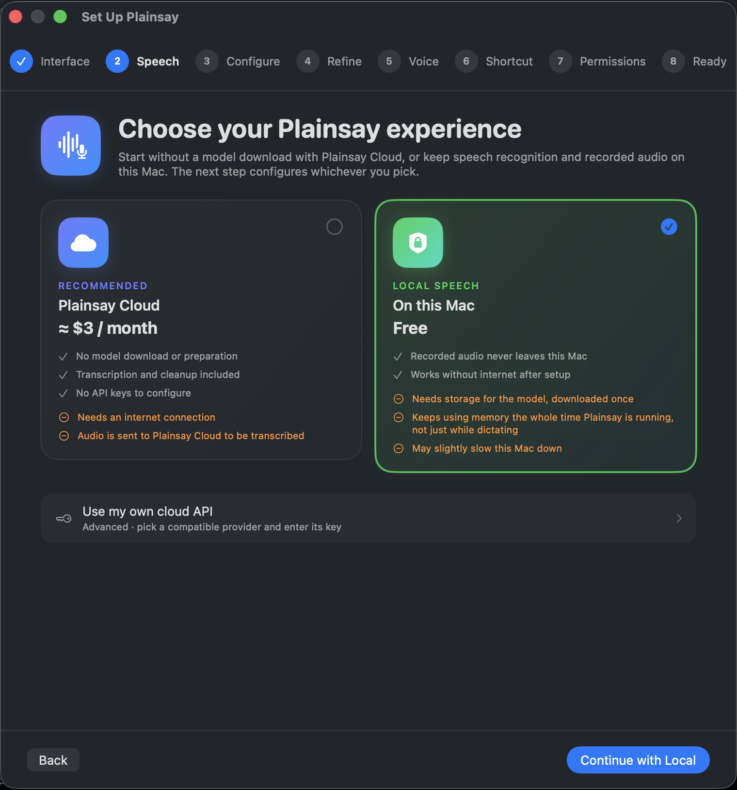
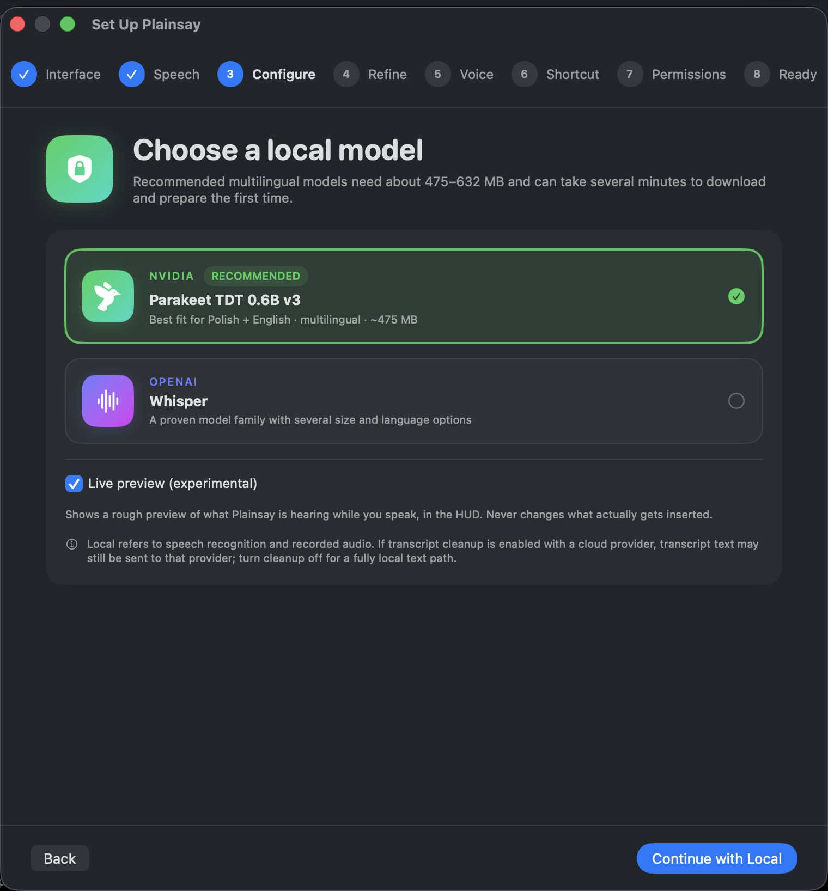
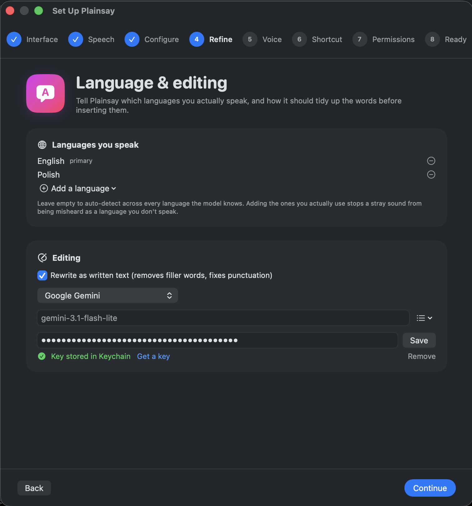
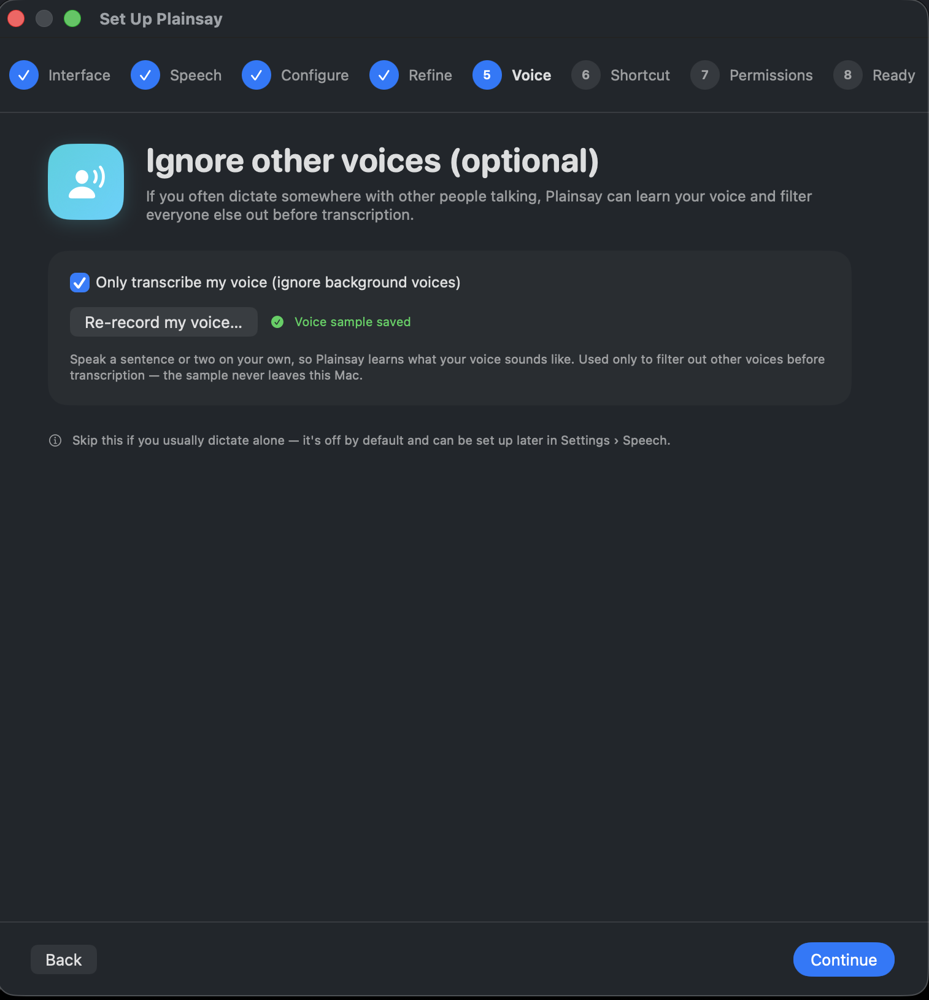
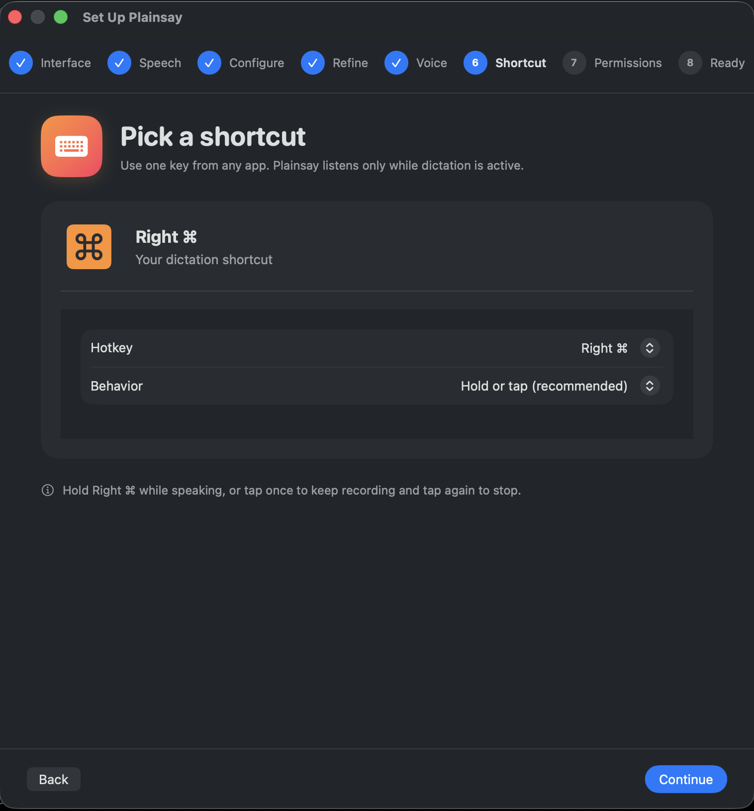
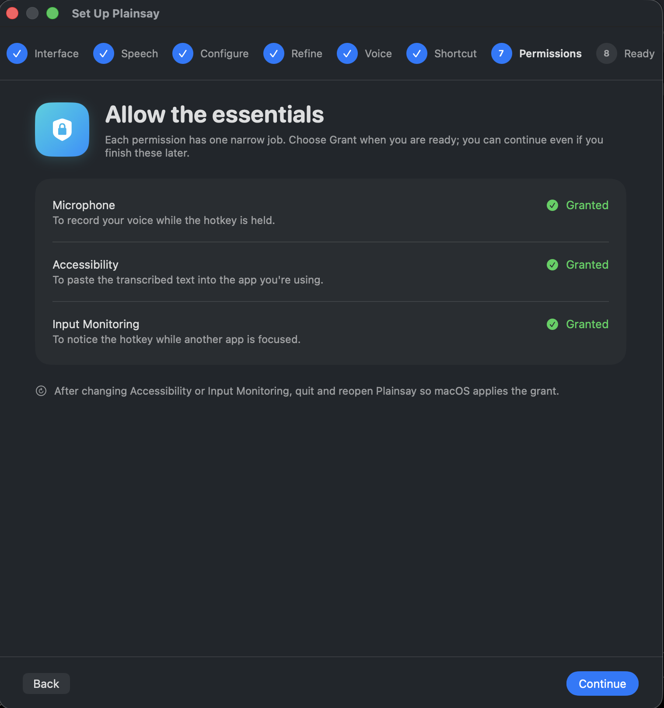
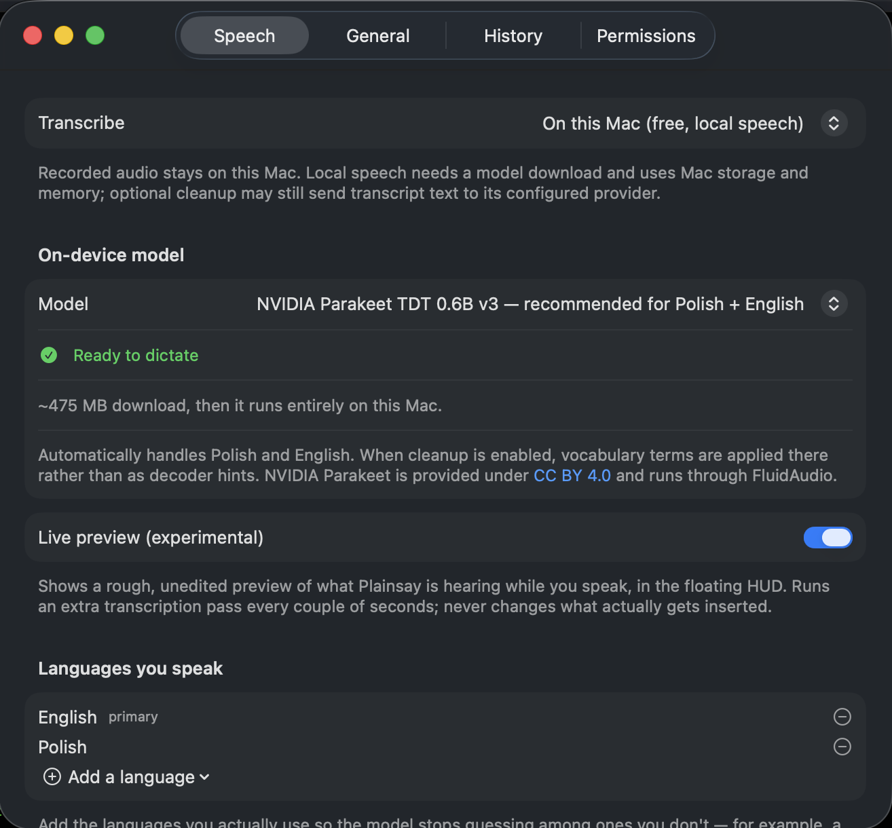
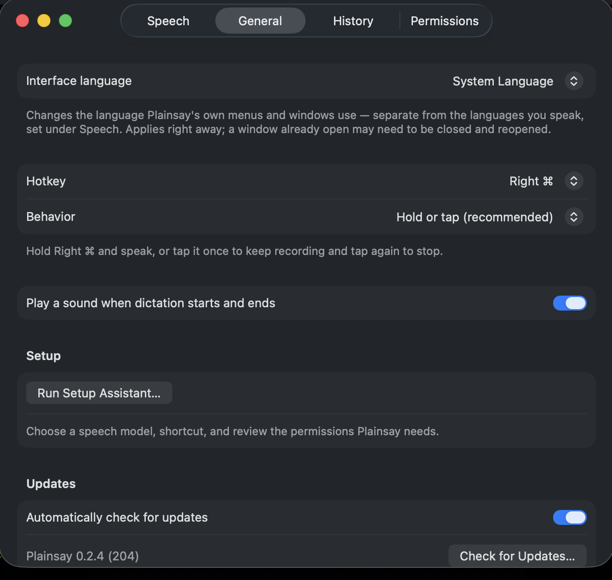
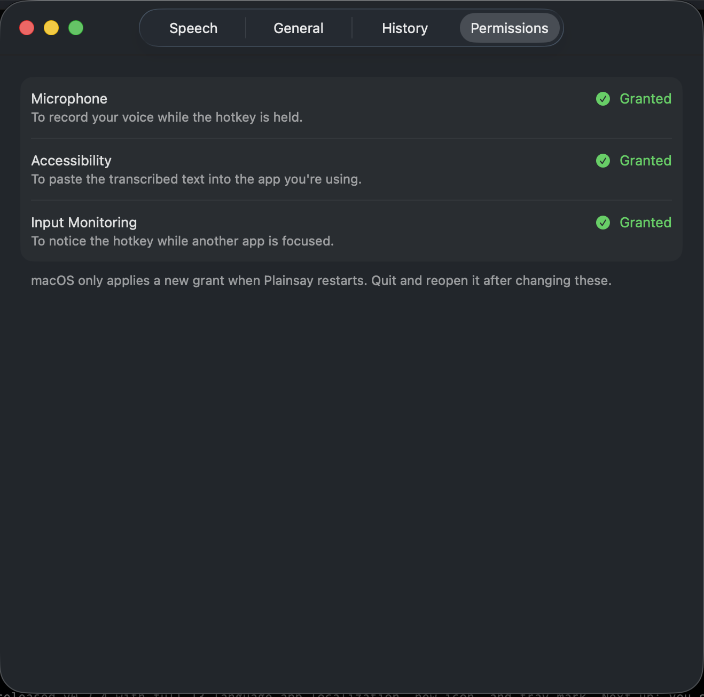

# Plainsay

**Plainsay is a free, MIT-licensed dictation app for Mac.** Transcription runs
on-device with Whisper or Parakeet — never in the cloud, never behind a
login. An optional LLM cleanup pass uses a key you control. No subscription.
No account required. [plainsay.app](https://plainsay.app)

The free, open-source, on-device [Wispr Flow](https://plainsay.app/vs/wispr-flow/).
Hold a key, speak, release — cleaned-up written text lands in whatever app
you're using.

Transcription runs entirely on your Mac. Choose Whisper via
[WhisperKit](https://github.com/argmaxinc/WhisperKit), or multilingual NVIDIA
Parakeet TDT 0.6B v3 via [FluidAudio](https://github.com/FluidInference/FluidAudio).
Both run as Core ML models on Apple silicon, accelerated by the Neural Engine.
A Gemini Flash Lite pass then turns spoken language into written language:
filler words out, punctuation in, your wording intact — see
[why on-device](https://plainsay.app/why-on-device/) for exactly what that
means.

## Screenshots

<p align="center">
  
  <br><sub>The HUD, right where you're already typing</sub>
</p>

**Setup Assistant** — walks through everything on first run:

<table>
<tr>
<td width="33%"><a href="Screenshots/setup-speech.png"></a><br><sub>Choose Plainsay Cloud or local speech</sub></td>
<td width="33%"><a href="Screenshots/setup-configure.png"></a><br><sub>Pick a local model — Parakeet or Whisper</sub></td>
<td width="33%"><a href="Screenshots/setup-refine.png"></a><br><sub>Languages you speak, and cleanup</sub></td>
</tr>
<tr>
<td width="33%"><a href="Screenshots/setup-voice.png"></a><br><sub>Optional: ignore other voices in the room</sub></td>
<td width="33%"><a href="Screenshots/setup-shortcut.png"></a><br><sub>Pick your dictation shortcut</sub></td>
<td width="33%"><a href="Screenshots/setup-permissions.png"></a><br><sub>Grant the three permissions</sub></td>
</tr>
</table>

**Settings** — always one click away from the menu bar:

<table>
<tr>
<td width="33%"><a href="Screenshots/settings-speech.png"></a><br><sub>Speech — model, live preview, languages</sub></td>
<td width="33%"><a href="Screenshots/settings-general.png"></a><br><sub>General — interface language, hotkey</sub></td>
<td width="33%"><a href="Screenshots/settings-permissions.png"></a><br><sub>Permissions</sub></td>
</tr>
</table>

## Download

**[Download the latest release](https://github.com/conrader/plainsay/releases/latest)**
— a notarized, ready-to-run `Plainsay.app`. That link always resolves to
whatever `Scripts/release.sh` shipped most recently, so it never needs
updating by hand. The [Releases page](https://github.com/conrader/plainsay/releases)
is the changelog: every version's notes, oldest to newest.

Or via Homebrew:

```sh
brew tap conrader/plainsay
brew install --cask plainsay
```

Already running Plainsay? It checks for updates itself — no need to
re-download. See **Check for Updates…** in the menu bar.

## First launch

The Setup Assistant walks through all of this on its own — the steps below
are just what it's actually doing.

1. **Pick how speech gets transcribed** — Plainsay Cloud (no download,
   ≈$3/month), on-device Whisper or NVIDIA Parakeet (free, ~475–632 MB
   download, cached after the first run), or your own API key.
2. **Grant three permissions** — Microphone to hear you, Accessibility to
   paste, Input Monitoring to notice the hotkey while another app is focused.
   macOS only applies a new grant after a restart, so quit and reopen
   afterwards.
3. **Optional: add a cleanup key** in Settings › Speech, if you want filler
   words and punctuation cleaned up locally instead of through Plainsay
   Cloud. Get one at [aistudio.google.com](https://aistudio.google.com) for
   Gemini. It's stored in your Keychain. Without one, Plainsay still works —
   it inserts the raw transcript.

## Using it

Default hotkey is **Right ⌘**, in hybrid mode:

- **Hold** it and speak — recording ends when you let go.
- **Tap** it once — recording latches on; tap again to stop.

Settings › General switches to hold-only or toggle-only if the hybrid behavior
gets in your way.

Add names and jargon under Settings › Speech › Vocabulary. Whisper and hosted
models receive them as decoder conditioning; every model also uses them in the
cleanup prompt. Parakeet itself does not currently accept decoder prompts.

## How it works

```
key down ──► capture frontmost app, show HUD, start recording
             AVAudioEngine → 16kHz mono float, lock-free ring buffer
key up ────► stop, discard anything under 300ms
             WhisperKit or FluidAudio/Parakeet transcribe
             Gemini cleanup (3s timeout → falls back to raw transcript)
             pasteboard snapshot → set text → ⌘V → restore snapshot
```

Cleanup is best-effort by design. No key, no network, a timeout, an HTTP error
— you still get the raw transcript, and the HUD says it fell back. A dictation
is never lost to a failed API call.

Text is inserted by pasting rather than through the Accessibility API, which
fails silently in Electron apps, web views, and terminals. Your clipboard is
snapshotted and restored around the paste.

### Layout

- `Sources/PlainsayCore` — the pipeline. No UI, unit-testable.
- `Sources/PlainsayApp` — menu bar, HUD panel, settings.
- `docs/superpowers/specs/` — design document.

`TranscriptionEngine` and `TextCleaning` are protocols, so switching between
WhisperKit and Parakeet, or Gemini and another cleanup model, does not touch the
pipeline.

Building from source, and running the tests, are covered in
[CONTRIBUTING.md](CONTRIBUTING.md).
