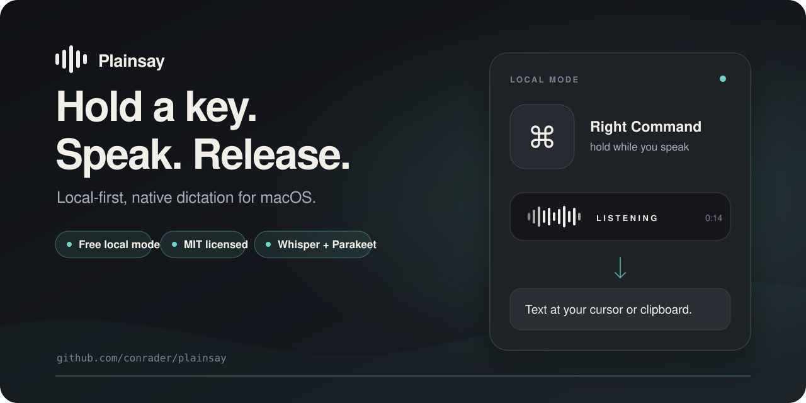
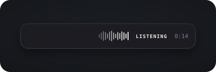

<p align="center">
  
</p>

<h1 align="center">Plainsay</h1>

<p align="center"><strong>Hold a key. Speak. Release. Get text at your cursor—or safely on the clipboard.</strong></p>

<p align="center">
  A native Mac dictation app in a 12 MB download, with Whisper and Parakeet running locally.
</p>

<p align="center">
  <a href="https://github.com/conrader/plainsay"><strong>Star Plainsay on GitHub ★</strong></a>
  · <a href="https://api.plainsay.app/releases/Plainsay-latest.dmg"><strong>Download Plainsay.dmg</strong></a>
  · <a href="#install">Homebrew</a>
  · <a href="https://plainsay.app/">Website</a>
  · <a href="BENCHMARK.md">Benchmark</a>
</p>

<p align="center">
  <a href="https://github.com/conrader/plainsay/releases/latest"></a>
  <a href="LICENSE"></a>
  
  
</p>

<p align="center">
  <a href="https://api.plainsay.app/releases/Plainsay-latest.dmg"></a>
</p>

<p align="center">
  <strong>12 MB native app · free Local mode · no account · no telemetry</strong>
</p>

Plainsay is free and MIT-licensed. With **Local transcription** and Polishing
off or running on your Mac, dictation audio is not uploaded, no account or
subscription is needed, and recognition works offline after the model download.
Automatic checks for signed updates are enabled by default and can be disabled
in Settings. Optional Plainsay Cloud provides hosted transcription and Polishing
for US$4 gross/month (VAT included); Cloud speech sends recorded
audio to the service and includes up to 900 transcription minutes in any rolling
30-day window. An active subscription also unlocks Auto-translate and automatic
email layout for new dictations from any transcription source. In v0.2.29,
those styles require a BYOK or compatible local Polishing provider; the built-in
Plainsay Cloud Polishing request does not yet carry their instructions.

> **Requirements:** macOS 14 or newer and an Apple-silicon Mac. The app is
> signed and notarized. Recommended multilingual models are separate one-time
> downloads of approximately 475–632 MB; smaller English-only options start at
> about 150 MB.

## Install

### Direct download

**[Download the latest notarized DMG](https://api.plainsay.app/releases/Plainsay-latest.dmg)**
and drag Plainsay to Applications. The stable link always points to the latest
release; the [release page](https://github.com/conrader/plainsay/releases/latest)
has checksums and release notes.

### Homebrew

```sh
brew install --cask conrader/plainsay/plainsay
```

Plainsay checks for signed updates automatically. You can also use **Check for
Updates…** from its menu-bar menu.

If Plainsay earns a place in your menu bar, **[star the repository](https://github.com/conrader/plainsay)**.
It is the simplest way to help more Mac users find the project.

## Why Plainsay?

- **Small, native Mac app.** The current notarized DMG is about 12 MB. Plainsay
  is written in Swift and stays out of the way in the menu bar.
- **Two genuinely local engines.** Choose Whisper through
  [WhisperKit](https://github.com/argmaxinc/WhisperKit) or multilingual NVIDIA
  Parakeet through [FluidAudio](https://github.com/FluidInference/FluidAudio).
- **Measured, not hand-waved.** The committed benchmark records every
  reference, hypothesis, and timing. On the benchmark machine and its disclosed
  50-clip English sample, prepared-model average latency was 0.10 s for Parakeet
  and 0.68 s for Whisper, with the first inference included.
- **Broad insertion support.** Plainsay uses the standard paste flow across
  many native apps, Electron apps, web views, and terminals, then attempts to
  restore the previous clipboard contents.
- **Safe fallback.** Polishing is optional and time-bounded. If it is disabled,
  offline, or fails, Plainsay continues with the raw transcript. If no safe
  paste target is found, the text stays on the clipboard.
- **Clear open-source boundary.** The Mac client code, benchmark harness, and
  release scripts are MIT-licensed and auditable; the committed LibriSpeech
  clips are CC BY 4.0. Plainsay Cloud is a separate optional hosted service.

## Verifying the models

Plainsay is signed and notarised, then downloads a Core ML speech model at first
run and executes it. Neither WhisperKit nor FluidAudio verifies a file it has
just fetched, so until v0.2.27 nothing did. Expected digests for every supported
model now ship inside the signed bundle. Before loading, Plainsay hashes the
pinned files that were actually downloaded and refuses any present file whose
contents differ. Repository paths absent because a library downloads only a
subset are reported, not treated as tampering.

[Nobody was checking the speech models](https://plainsay.app/verifying-models/)
— what the libraries actually guarantee, why verifying against a hash from the
same server proves nothing, and what the fix does and does not buy.

## How it compares

Side-by-side pages for the alternatives, written to be useful rather than
flattering — each one ends with the cases where the other app is the better buy.

**[All the main Mac dictation apps compared](https://plainsay.app/compare/)** —
price, what stays on your Mac, what needs an account.

[vs Wispr Flow](https://plainsay.app/vs/wispr-flow/) ·
[vs superwhisper](https://plainsay.app/vs/superwhisper/) ·
[vs VoiceInk](https://plainsay.app/vs/voiceink/) ·
[vs MacWhisper](https://plainsay.app/vs/macwhisper/) ·
[vs Apple Dictation](https://plainsay.app/vs/macos-dictation/)

One worth stating here: Plainsay dictates, and that is all it does. It has no
file import, so if you have recordings to transcribe rather than words to speak,
[MacWhisper](https://plainsay.app/vs/macwhisper/) is the tool for that job.

## What leaves your Mac?

| Configuration | Recorded audio | Transcript text | Account | Cost |
|---|---|---|---|---|
| Local transcription, Polishing off or running on your Mac | Stays on your Mac | Stays on your Mac | No | Free |
| Local transcription + hosted Polishing | Stays on your Mac | Sent to the provider you select | Depends on provider | Depends on provider |
| Plainsay Cloud | Sent to Plainsay Cloud | Returned by Cloud; sent onward if Cloud Polishing is enabled | Yes | US$4 gross/month, VAT included; 900 transcription minutes per rolling 30 days |
| Your own speech API | Sent directly to the provider you configure | Returned to Plainsay | Provider key | Provider pricing |

The hosted routes are explicit:

- **Your own provider:** audio, a language hint, and optional vocabulary prompt
  go directly to the speech endpoint you configure (Groq, deAPI, OpenAI, or a
  compatible custom service). Hosted Polishing sends transcript text,
  vocabulary terms, and any enabled translation-target or email-layout
  instructions directly to Google Gemini, Anthropic, OpenRouter, OpenAI, or the
  compatible endpoint you configure.
- **Plainsay Cloud:** encoded audio, clip duration, language, and an optional
  vocabulary prompt go to `api.plainsay.app`. Speech may be processed on a
  Plainsay-operated transcription node or forwarded to deAPI. If Cloud
  Polishing is enabled, transcript text and vocabulary terms are sent from
  Plainsay Cloud to OpenRouter, using its configured Gemini model. The v0.2.29
  Cloud cleanup request does not send the Auto-translate target or email-layout
  instruction.
- **Optional Voice Filter:** filtering runs on the Mac, but it is best-effort.
  If the filter is unavailable or fails, a hosted speech mode receives the
  unfiltered recording.

Plainsay Cloud's application database stores account, authentication,
subscription, and usage records: an email address and/or Apple account
identifier, session records, Stripe customer/subscription identifiers and
status, plus each operation's timestamp, type, audio duration, estimated cost,
and Polishing token counts. It deliberately stores neither recorded audio nor
transcript text. Stripe receives the account email and handles checkout and
payment details; Apple handles Apple sign-in, and the configured email-delivery
service receives the address and sign-in message.

API proxy access logging is disabled. Minimal application event logs contain
only the method, matched route template, status, and elapsed time; they exclude
network addresses, headers, query strings, and request bodies. Website and
signed-update delivery can still produce ordinary web-server access records.

Local mode does not mean the app never uses the network: the selected model
must be downloaded once, and the default update check contacts
`api.plainsay.app` (it can be switched off). The Mac client sends no analytics
or telemetry. By default, History keeps up to 100 raw and final transcript
records on this Mac for 30 days. You can choose 7, 30, 90, or 365 days, clear the
records, or stop saving them; turning History off deletes saved transcripts.
Audio is staged in an owner-only local folder while a dictation is processed
and removed after a successful or completed attempt. Interrupted recordings
can remain for recovery. On each launch, Plainsay removes ones older than 7
days and keeps no more than the newest 20; clearing History purges them too.
These files are excluded from backups.

API keys and the Plainsay Cloud session token are stored in macOS Keychain.
Local mode is the default choice on a new installation; cloud use requires an
explicit choice.

## First dictation

1. Choose **On this Mac** for Local mode, then pick the recommended model for
   your languages. Choose a main language, then add any others you use. The
   main language is sent to providers and models that accept only one language
   hint, and is Whisper's fallback when a retry is needed.
2. Grant Microphone, Accessibility, and Input Monitoring permissions. Input
   Monitoring lets Plainsay notice the configured dictation shortcut, the
   `⌃⌥⌘T` translation toggle, and Escape while recording; it never records what
   you type or includes keystrokes in a transcript. On the first request,
   Plainsay brings the system prompt to the front. If you request the permission
   again after macOS no longer has a prompt to show, Plainsay opens the correct
   System Settings pane. macOS may quit Plainsay after a new grant takes effect;
   reopen it and Setup resumes at the same step.
3. Hold **Right Command**, speak, and release. Tap it once instead if you prefer
   toggle mode; tap again to stop.

Each dictation can run for up to 10 minutes. At the boundary, Plainsay stops
recording automatically, shows a notice, and processes the captured audio.

The shortcut, languages, vocabulary, model, and hold/toggle behavior can all be
changed later in Settings.

### Languages, translation, and email layout

- **Wrong-language guard.** With spoken languages configured, Whisper retries
  an evidently out-of-list result in your main language. Parakeet cannot force
  that retry, so it records narrow, high-confidence mismatches in diagnostics
  instead of claiming to have fixed them.
- **Auto-translate (Cloud entitlement).** Choose a target from your configured
  spoken languages or English in the menu-bar menu. With a style-aware BYOK or
  compatible local Polishing provider selected, each new dictation is
  translated until you switch it off. Press
  **Control–Option–Command–T** (`⌃⌥⌘T`) anywhere to toggle the last target.
  Translation is off by default and requires Polishing to be enabled and
  configured.
- **Email mode (Cloud entitlement).** This is off by default. Enable **Format
  dictation as an email** in Settings › General. In supported mail apps and
  recognized webmail compose windows, Plainsay separates a spoken greeting,
  body paragraphs, and sign-off without adding words you did not say. It also
  requires Polishing.
- **Every provider honors the style.** Until 0.2.31 the built-in Plainsay Cloud
  route did not: its request omitted the layout and translation fields, so the
  subscribers those features are sold to were the only people they did nothing
  for. The request now carries them as structured fields — never prompt text,
  which the server composes itself. Audio recovered after a relaunch is still
  polished as plain text: the window it was aimed at is long gone.
- **Vocabulary suggestions.** Settings can propose recurring names and product
  terms from saved dictations. Nothing is added unless you choose **Add**, and
  you can dismiss a suggestion instead. Applied vocabulary corrections use
  conservative edit thresholds, score every candidate, and choose the closest
  match rather than the first acceptable one.

## How it works

```text
key down ──► remember frontmost app → show HUD → record 16 kHz mono audio
key up ────► transcribe locally, in Plainsay Cloud, or through your API
             optional Polishing, translation, and email layout
             (bounded timeout or truncated reply → raw-transcript fallback)
             snapshot clipboard → paste text → attempt clipboard restore
```

The local engines run as Core ML models accelerated on Apple silicon.
Polishing asks the selected model to turn spoken language into written language
while preserving wording, meaning, and tone; by default it also preserves the
language. With Auto-translate enabled and a style-aware BYOK or compatible local
provider selected, it renders each new result in the target language instead.
Review important text. Polishing can use Plainsay Cloud, your provider, a
compatible local endpoint, or remain off; the current Cloud request performs
ordinary cleanup without the translation or email-layout style. It is also
instructed not to invent an ending for a transcript cut off mid-sentence; if a
provider reports that its own reply hit an output limit, Plainsay keeps the raw
transcript instead of inserting partial edited text.

Read [How it works](https://plainsay.app/how-it-works/) for the pipeline and
[Why on-device](https://plainsay.app/why-on-device/) for the privacy trade-offs.

## Reproducible benchmark

| Local engine | Word error rate | Average latency | Real-time factor |
|---|---:|---:|---:|
| Parakeet TDT 0.6B v3 | **2.50%** | **0.10 s** | 0.014 |
| Whisper large-v3-turbo | **2.89%** | **0.68 s** | 0.095 |

These are prepared-model results on a disclosed 50-utterance sample from
LibriSpeech `test-clean`; the first inference is included and no hidden
transcription warm-up is subtracted. They are not a claim about every language
or noisy real-world dictation. The exact Mac, source commit, dependency pins,
methodology, limitations, raw results, and one-command harness are in
[BENCHMARK.md](BENCHMARK.md).

## Screenshots

<p align="center">
  <a href="Screenshots/hud-listening.svg"></a><br>
  <sub>The listening HUD stays beside the text cursor while a dictation is active.</sub>
</p>

## Troubleshooting

Settings › About shows the installed version and has a one-click
**Copy Diagnostics Command** action. Run the copied command in Terminal when a
dictation, permission, model, or provider problem needs a detailed report. Its
audio diagnostics compare how long recording was active with how much audio was
actually captured, making an early microphone cut-off visible.

## Build and contribute

Bug reports, small fixes, tests, documentation improvements, and focused
feature proposals are welcome. Start with [CONTRIBUTING.md](CONTRIBUTING.md),
which covers the development build, tests, and how to propose a change.

```sh
swift build
swift test
```

For security issues, please follow [SECURITY.md](SECURITY.md) instead of
opening a public issue.

## Contact

- Bugs: [open an issue](https://github.com/conrader/plainsay/issues/new/choose)
- Ideas and questions: [GitHub Discussions](https://github.com/conrader/plainsay/discussions)
- Everything else: [hi@plainsay.app](mailto:hi@plainsay.app)
